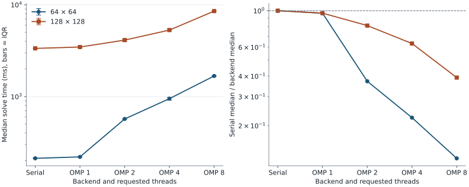

# Wave Function Collapse: Project 801

The serial C++17 solver completes the recorded **128 × 128** binary workload in **3.35 s median**, versus **8.54 s with OpenMP at eight threads** under the pinned WSL2 CPU and passive-wait protocol. All **50 measured solves** succeeded. [Raw measurements](bench/results/2026-09-12/runs.csv).

## Abstract

This CHPS0801 coursework project generates grids from local patterns extracted from an example. It implements the overlapping Wave Function Collapse model with serial, OpenMP and optional Kokkos backends. A shared candidate representation and seeded search support comparisons without replacing the algorithm. The current CPU experiment checks two output sizes and four OpenMP thread counts with common seeds. It finds no OpenMP speedup on the selected binary workload. The result applies to this sample, build, affinity policy and waiting mode; Kokkos, GPU execution and the Unreal Engine demonstration remain unmeasured in this revision.

## Context and problem

The generator extracts square patterns from a supplied grid and constructs overlap constraints. It repeatedly selects a low-entropy cell, chooses a pattern and propagates restrictions. Contradictions can exhaust the retry budget, so local pattern matching does not guarantee that every requested output can be generated. The original coursework specification is [README.pdf](README.pdf).

## Approach

`TileSet` stores patterns and frequencies, `OverlapRules` stores compatibility masks, and `Wave` stores remaining candidates in flat buffers of `uint64_t` words. The serial backend is the reference for OpenMP's task-based selection and propagation. The benchmark leaves symmetry expansion, parallel attempts and backtracking at their existing defaults. [Design and comparison boundaries](docs/design.md).


## Results

Median solve time, with the interquartile range in parentheses, from five fixed seeds after one excluded warm-up:

| Backend | 64 × 64, seconds | 128 × 128, seconds |
|---|---:|---:|
| Serial | 0.2121 (0.0028) | 3.3477 (0.0179) |
| OpenMP, 1 thread | 0.2197 (0.0016) | 3.4645 (0.0404) |
| OpenMP, 2 threads | 0.5694 (0.0065) | 4.1217 (0.2929) |
| OpenMP, 4 threads | 0.9478 (0.0642) | 5.3001 (0.2760) |
| OpenMP, 8 threads | 1.6757 (0.0298) | 8.5365 (0.1951) |

<picture>
  <source media="(prefers-color-scheme: dark)" srcset="docs/assets/benchmark-dark.svg">
  
</picture>

The ratio on the right is serial median divided by backend median; values below one indicate a slowdown. The measurements use `binary_5x5.txt`, tile size 2, one seed-41 warm-up and seeds 42 through 46. [Full protocol, environment and raw evidence](docs/results.md).

## What works

- The CPU Release build completed and all thirteen CTest suites passed. These include successful serial/OpenMP output comparisons, input structures and contradiction paths. [Build/test log](bench/results/2026-09-12/build-tests.log).
- All fifty measured benchmark solves report success; the ten excluded warm-ups also succeeded. [Original per-process CSV files](bench/results/2026-09-12/raw/).
- The collector records commands, affinities, versions, hashes and failure status. Both theme variants of the figure are generated from the committed CSV summary by [bench/plot.py](bench/plot.py).

## What does not work

- OpenMP does not accelerate this workload under the recorded waiting and affinity settings. Task and synchronization overhead are possible causes; they were not separately profiled in this experiment.
- A 3 × 3 checkerboard request with tile size 2, seed 42 and one attempt reports `success: no`, yet the CLI exits with code 0. A caller must inspect the success status. [Captured failure](bench/results/2026-09-12/contradiction.json).
- The legacy `scripts/run_benchmark.sh` passes a positional sample to an executable that requires `--sample`. Use `bench/run.sh` for the current protocol.
- The optional dungeon build emits a `-Wcomment` warning from a nested marker in a source comment. Kokkos, GPU, sanitizers, LaTeX compilation and the Unreal Engine editor were not revalidated. Hosted CI remains pending publication.

## Limits and scope

This is a finite CPU comparison on one binary sample. The guest topology, CPU frequency, operating-system scheduling and OpenMP wait policy can affect results. The five common seeds include variation in generated problems as well as timing noise; the IQR is not a confidence interval. No peak-memory, GPU, cluster or editor performance claim is made. Historical results and illustrations remain separate from the current evidence.

| Area | Status and reason |
|---|---|
| Kokkos and GPU | Not measured (non mesuré): Kokkos was not configured in the validated build, so this campaign has no Kokkos or GPU execution target. |
| Unreal Engine | Not measured (non mesuré): the external editor and plugin were not exercised by this WSL CPU campaign. |
| Peak memory and energy | Not measured (non mesuré): the collector records solver timing and success, without peak-memory or energy instrumentation. |
| Cluster scaling | Not measured (non mesuré): the current campaign used the local WSL guest; no new cluster run was scheduled. |
| Sanitizers and coverage | Not measured (non mesuré): validation used the existing Release build and CTest suites, without sanitizer or coverage instrumentation. |
| LaTeX build | Not measured (non mesuré): references were checked as files; the report and slides were not compiled in this overhaul. |

## Reproducibility

| Component | Recorded setting |
|---|---|
| CPU | Intel Core i9-13900H; WSL reports 20 logical CPUs |
| Affinity | Guest CPU IDs 0, 2, 4, 6, 8, 10, 12, 14; first requested count per configuration |
| Memory | 16149672 kB visible to WSL; no per-solver peak measurement |
| System | Ubuntu 24.04.4 LTS, WSL2 kernel 6.6.87.2 |
| Build | GCC 13.3.0, Release, `-O3 -march=native`, OpenMP on, Kokkos/LTO off |
| Tools | CMake 3.28.3; libgomp1 14.2.0-4ubuntu2~24.04.1 |
| Python | 3.12.3 for collection; [pinned plotting packages](bench/requirements.txt) |
| OpenMP | Dynamic teams off, close binding, core places, passive waiting |
| Input | `samples/binary_5x5.txt`, tile size 2, maximum five attempts |
| Repetitions | One excluded warm-up; five measured seeds 42, 43, 44, 45, 46 |
| Statistic | Median and inclusive linear quartiles of existing `solve_s` |

Once this branch is published, the complete path from a clone to regenerated figures is:

```bash
git clone --branch chore/repo-overhaul https://github.com/Gotman08/Projet801.git
cd Projet801
sudo apt-get install build-essential cmake python3-venv
cmake -S . -B build -DCMAKE_BUILD_TYPE=Release \
  -DUSE_OMP=ON -DUSE_KOKKOS=OFF -DBUILD_DUNGEON=ON
cmake --build build --parallel 2
ctest --test-dir build --output-on-failure
BUILD_DIR=build PYTHON=python3 bash bench/run.sh
python3 -m venv .venv
.venv/bin/python -m pip install -r bench/requirements.txt
.venv/bin/python bench/plot.py --input bench/results/local/summary.csv
```

To redraw the committed measurement without rerunning solvers, use `.venv/bin/python bench/plot.py`. The collector requires Linux affinity support and eight distinct guest-reported cores; it fails clearly if those conditions are unavailable. The record includes the exact compiler and OpenMP runtime versions in [environment.json](bench/results/2026-09-12/environment.json).

## Installation and usage

```bash
sudo apt-get install build-essential cmake python3-venv
cmake -S . -B build -DCMAKE_BUILD_TYPE=Release \
  -DUSE_OMP=ON -DUSE_KOKKOS=OFF -DBUILD_DUNGEON=ON
cmake --build build --parallel 2
ctest --test-dir build --output-on-failure

./build/wfc_serial samples/binary_5x5.txt --rows 64 --cols 64 -N 2 --seed 42
./build/wfc_omp samples/binary_5x5.txt --rows 64 --cols 64 -N 2 --seed 42 --threads 4
```

These CLI examples use the normal application settings; use the collector for the controlled timing protocol. The validated build and supported optional targets are described in [BUILD.md](docs/BUILD.md).

## Repository layout

| Path | Purpose |
|---|---|
| `apps/`, `include/`, `src/` | Existing C++ applications, interfaces and implementations |
| `tests/`, `samples/` | CTest suites and supplied input grids |
| `bench/` | CPU collector, plotter, requirements and raw evidence |
| `docs/` | Current design/results and historical technical material |
| `results/`, `rapport/` | Historical measurements, report sources and submitted slides |
| `ue5_plugin/` | Optional editor integration, not exercised here |
| `third_party/` | Image-writing dependency with its embedded license |

Exact duplicate artifacts were consolidated with a [path map](docs/artifact-map.json); report image references now use the retained copies. Historical report and illustration content is retained without treating it as newly reproduced evidence.

## Next steps

Profile task and barrier costs under controlled active/passive waiting, then extend the seed and sample set before drawing general scaling conclusions. Improve CLI failure signalling in a separate behavior change. Validate Kokkos on a configured target and exercise the Unreal editor integration before adding either to current claims.

## References

- [Maxim Gumin's WaveFunctionCollapse](https://github.com/mxgmn/WaveFunctionCollapse), the original overlapping-model description and implementation.
- [Kokkos programming model](https://kokkos.org/kokkos-core-wiki/ProgrammingGuide/ProgrammingModel.html), background for the optional backend.
- [C++ draft: vector<bool>](https://eel.is/c++draft/vector.bool), relevant to the corrected storage discussion in the design notes.
- [Coursework specification](README.pdf), [report source](rapport/main.tex) and [submitted slides](rapport/slides.pdf), retained project material.

## License

No license grant has been established for the original project. [LICENSE](LICENSE) records the authors' reserved rights and preserves third-party terms. `stb_image_write.h` retains its embedded license. Contributor authority must be confirmed before a new project license is adopted.
