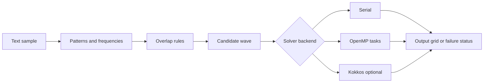

# Design and comparison boundaries

The project implements the overlapping form of Wave Function Collapse from its CHPS0801 coursework specification. [TileSet](../src/TileSet.cpp) extracts observed patterns and frequencies; [OverlapRules](../src/OverlapRules.cpp) computes compatible overlapping neighbours; [Wave](../include/wfc/Wave.hpp) tracks remaining candidates. The shared solver layer selects a low-entropy cell, chooses a tile and propagates restrictions until completion or contradiction.

## Choices supported by the code

The candidate buffers contain explicit `uint64_t` words. `BitsetView` exposes those words for intersections and population counts; `Wave` owns a flat buffer and returns views into it. This gives the code direct access to its representation. It does not establish a density advantage over `std::vector<bool>`, whose specialization supports space-optimized storage. The old claim that `vector<bool>` is simply a byte-vector wrapper was incorrect. [C++ draft specification](https://eel.is/c++draft/vector.bool).

Serial selection uses frequency-weighted entropy and stateless cell jitter based on the cell and seed. The shared seeded selection/retry machinery supports reproducibility within the tested implementation and toolchain. The existing OpenMP test checks successful output equality against serial at several thread counts; it does not prove portability across every compiler and random-library implementation.

OpenMP implements task-based minimum selection and propagation. The source contains serial fallbacks for small work and atomic word operations for concurrent restrictions. The new experiment measures the resulting implementation as a whole. It does not isolate the cost of individual task, barrier or atomic operations. Synchronization overhead is a plausible explanation for slow cases, not a directly measured component attribution.

The existing code offers retry, parallel attempts, symmetry expansion and backtracking. The current benchmark leaves the latter three at their defaults and allows up to five retries. In the shared implementation, enabling backtracking or parallel attempts invokes serial helper searches; those options do not measure the same OpenMP propagation path as the default benchmark.

## Alternatives and retained layout

The serial backend is the reference implementation for the CPU comparison. No new naive baseline was added, and no claim is made about the measured benefit of earlier optimizations. Kokkos is optional and was not configured for this run. The external Unreal Engine demonstration consumes the optional dungeon export; the editor and plugin were not executed during the overhaul.

No independently verified record of rejected design alternatives was recovered. The descriptions above explain current structures without inventing selection experiments. Existing `apps/`, `include/`, `src/`, `tests/` and `samples/` paths remain unchanged. The refactor consolidates exact artifact duplicates and documentation paths; it does not change solver logic.
